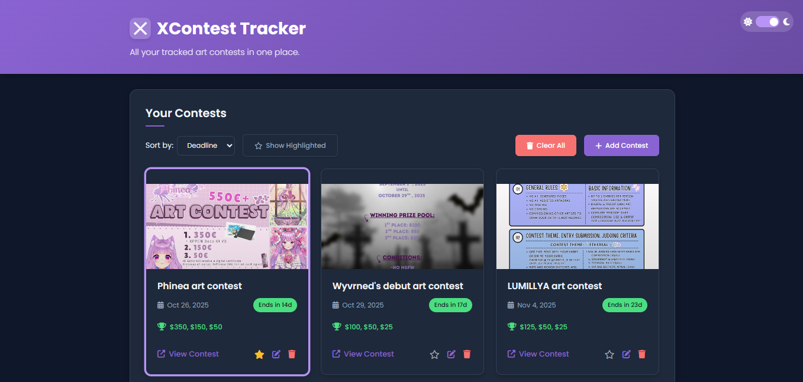

# XContest Tracker

[](https://developer.mozilla.org/en-US/docs/Web/HTML)
[](https://developer.mozilla.org/en-US/docs/Web/CSS)
[](https://developer.mozilla.org/en-US/docs/Web/JavaScript)
[](https://fontawesome.com/)
[](https://developer.mozilla.org/en-US/docs/Web/API/Window/localStorage)
[](LICENSE)



Una aplicación web moderna para gestionar y hacer seguimiento a concursos de arte. Permite agregar, organizar y monitorear concursos con fechas límite, premios e imágenes.

## 🎨 Características

- **Gestión de Concursos**: Agrega y organiza concursos de arte con información detallada
- **Seguimiento de Fechas**: Visualiza fechas límite con contadores en tiempo real
- **Gestión de Premios**: Configura premios individuales o prize pools
- **Subida de Imágenes**: Previsualiza y guarda imágenes de concursos
- **Modo Oscuro/Claro**: Alterna entre temas para mejor experiencia visual
- **Ordenamiento**: Ordena concursos por fecha o título
- **Almacenamiento Local**: Los datos se guardan en el navegador
- **Diseño Responsivo**: Funciona perfectamente en dispositivos móviles y escritorio

## 🚀 Tecnologías Utilizadas

- **HTML5**: Estructura semántica y accesible
- **CSS3**: Estilos modernos con variables CSS y gradientes
- **JavaScript (ES6+)**: Funcionalidad interactiva y gestión de datos
- **Font Awesome**: Iconografía profesional
- **LocalStorage**: Persistencia de datos en el navegador

## 📁 Estructura del Proyecto

```
xcontest-tracker/
├── index.html          # Página principal
├── css/
│   └── styles.css      # Estilos de la aplicación
├── js/
│   └── script.js       # Lógica de la aplicación
├── assets/             # Recursos adicionales
├── favicon.ico         # Icono del sitio
├── README.md           # Documentación
└── .gitignore          # Archivos ignorados por Git
```

## 🛠️ Instalación y Uso

### Prerrequisitos
- Un navegador web moderno (Chrome, Firefox, etc.)

1. **Clona el repositorio**:
   ```bash:disable-run
   git clone https://github.com/tu-usuario/xcontest-tracker.git
   cd xcontest-tracker
   ```

2. **Abre el archivo**:
   - Simplemente abre `index.html` en tu navegador web
   - O usa un servidor local como Live Server en VS Code

3. **¡Comienza a usar!**:
   - Agrega tu primer concurso usando el formulario
   - Sube una imagen representativa
   - Configura los premios y fecha límite
   - Haz clic en "Guardar Concurso"

## 📱 Funcionalidades Principales

### Agregar Concurso
- URL del post de Twitter/X
- Título descriptivo
- Fecha y hora límite
- Imagen del concurso
- Configuración de premios (individuales o prize pool)

### Gestión de Concursos
- Vista en tarjetas con información completa
- Contador de días restantes
- Enlaces directos a los posts originales
- Eliminación de concursos
- Ordenamiento por fecha o título

### Personalización
- Tema claro/oscuro
- Diseño responsivo
- Interfaz intuitiva y moderna

## 🤝 Contribución

1. Fork el proyecto
2. Crea una rama para tu feature (`git checkout -b feature/AmazingFeature`)
3. Commit tus cambios (`git commit -m 'Add some AmazingFeature'`)
4. Push a la rama (`git push origin feature/AmazingFeature`)
5. Abre un Pull Request

## 📄 Licencia

Este proyecto está bajo la Licencia MIT. Ver el archivo `LICENSE` para más detalles.

## 👨‍💻 Autor

**Argenis Chacon B.**

[](https://www.linkedin.com/in/argenischaconb/)
[](https://github.com/argenischacon)

---

⭐ Si este proyecto te resultó útil, ¡dale una estrella!
